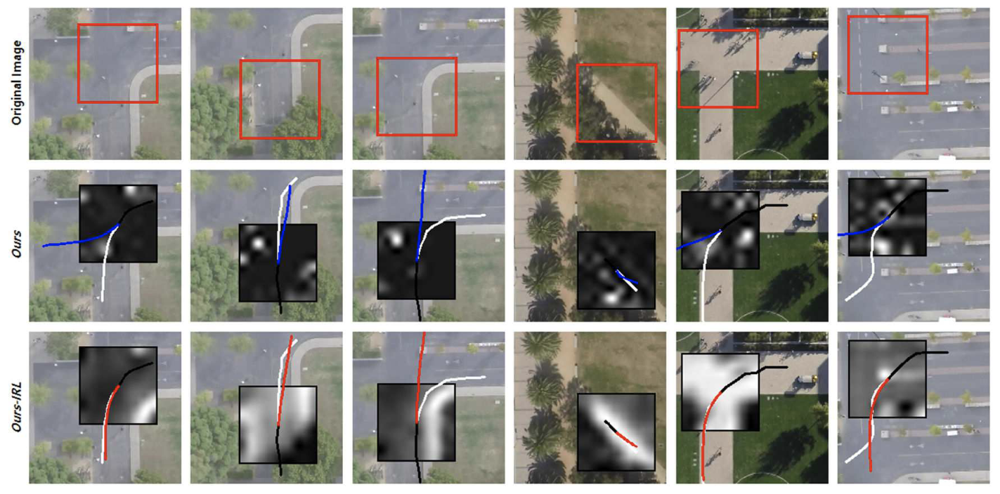

# Official implementation of "Regularizing Neural Networks for Future Trajectory Prediction via Inverse Reinforcement Learning Framework" published in IET Computer Vision.



The paper is published in IET Computer Vision. If you want to see the ArXiv version of the paper, visit https://arxiv.org/abs/1907.04525. 

A copy of the IET CV version can be found at https://www.researchgate.net/publication/339430005_Regularizing_Neural_Networks_for_Future_Trajectory_Prediction_via_Inverse_Reinforcement_Learning_Framework.

## Setup
All the codes were developed on Ubuntu 16.04 with Python 3.5 and Tensorflow 1.10.0. Two folders, **Crowd** and **SDD**, in the root directory contains 1) datasets, 2) trained models, and 3) the implementation codes respectively for **ETH/UCY** and **Standford Drone Dataset**. 

## Train New Models

To train the network from scratch, run the followings. The parameters of the trained networks will be stored at the folder ***saved_1_0***.
```sh
$ python crowd_train.py --dataset_num 1 --exp_id 0
$ python sdd_train.py --dataset_num 1 --exp_id 0
```
**crowd_train.py** and **sdd_train.py** have a number of command-line flags that you can use to configure the model architecture, hyperparameters, and input / output settings. You can find the descriptions in the files.


To test the trained model, run the followings. The program will automatically read the parameters of the train networks in the folder ***saved_1_0***.
```sh
$ python crowd_test.py --dataset_num 1 --exp_id 0
$ python sdd_test.py --dataset_num 1 --exp_id 0
```

## Pretrained Models
Download the pre-trained models from https://www.dropbox.com/sh/nbxr12n6i3jgoi5/AABH3URiRQ_wwYU--lGDIHZTa?dl=0
Each model in the downloaded folder is the result with the best gamma parameter reported in the paper.

## Citation
```
@article{Choi,
author = {D. Choi and K. Min and J. Choi},
title = {Regularising neural networks for future trajectory prediction via inverse reinforcement learning framework},
journal = {IET Computer Vision},
volume = 14, 
issue = 5,
pages = {192-200}, 
year = 2020
}
```
